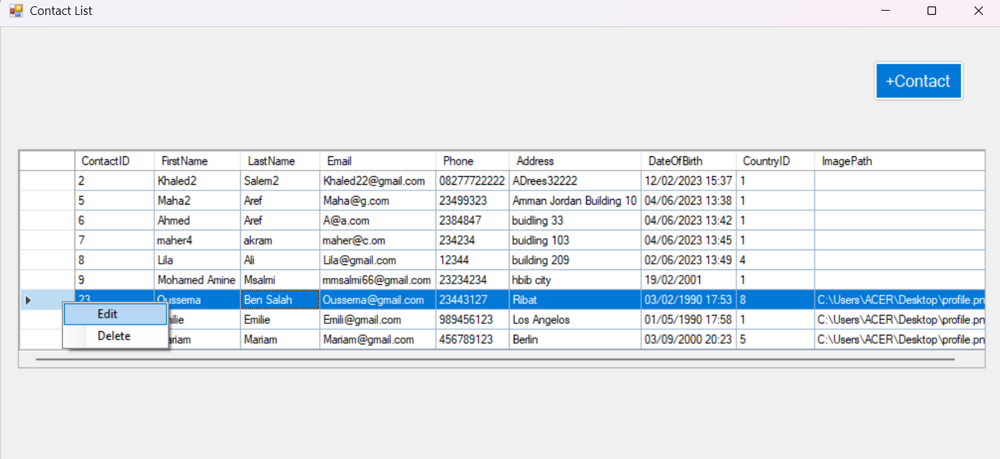
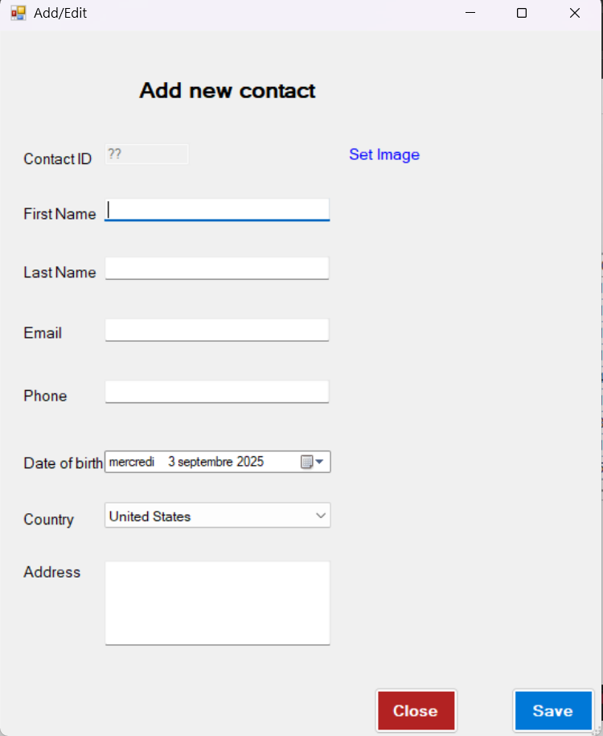
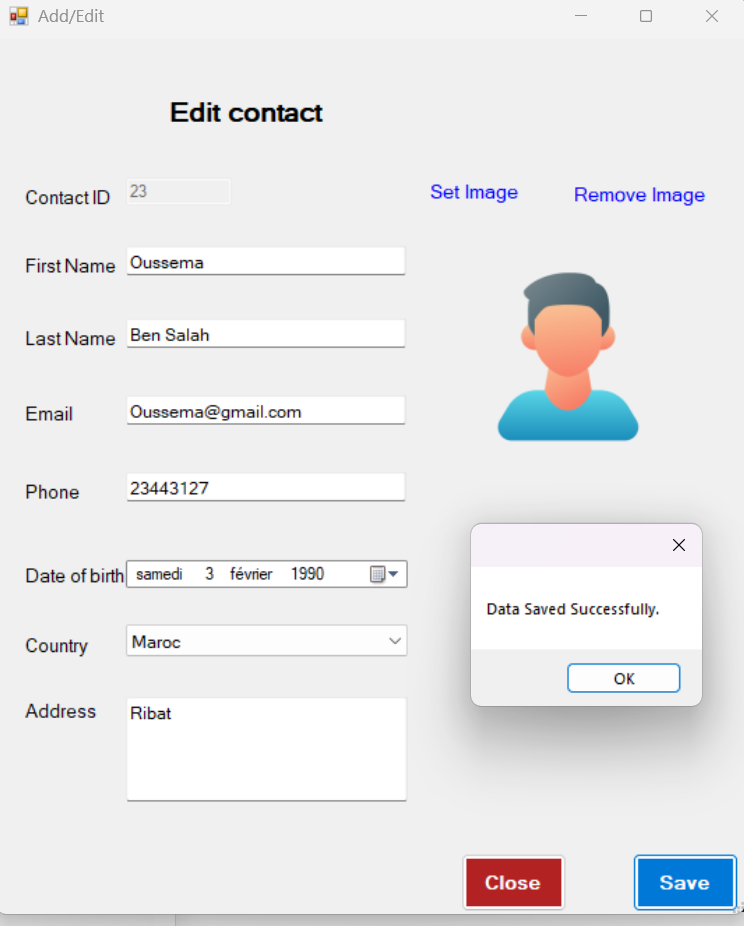

# Contact Management Application

A **Windows Forms Application** built with **.NET Framework** to manage contacts.  
The project demonstrates **CRUD operations** using **3-tier architecture** design.

### Clear Separation of Layers:

- **Data Access Layer (DAL):** Handles database operations (SQL queries).
- **Business Layer (BLL):** Implements business rules and logic.

- **Presentation Layer (UI):** Windows Forms for user interaction.

             |          
